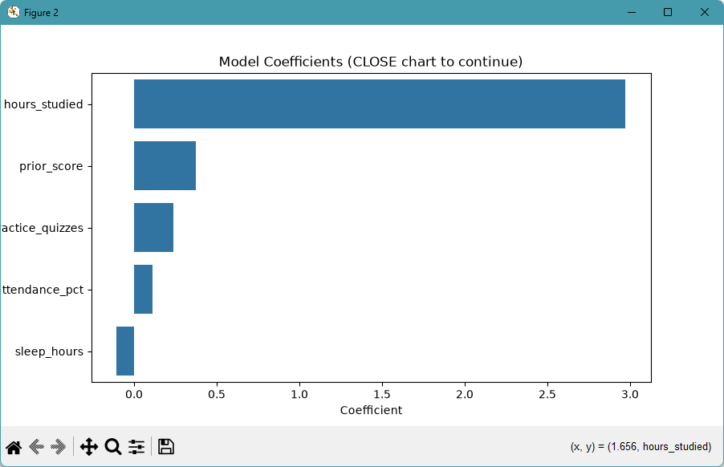

# ml-01-intro

[](https://denisecase.github.io/pro-analytics-02/workflow-b-apply-example-project/)
[](./pyproject.toml)
[](./LICENSE)

> Professional Python project: characterizing machine learning.

## Project Description

This project focuses on learning to find good data problems in a dataset,
and learning when machine learning (ML) might be helpful.

We learn to characterize:

- supervised (when we pick a target to predict)
- unsupervised (no target, just exploring, e.g. clustering)

In this project, we pick a dataset and a target.

If the target is:

- a discrete category column, we know it is a classification problem
- a continuous numeric column, we know it is a regression problem.

Some numbers are actually categories, for example a rating of 1, 2, 3.
May be better characterized as a category / discrete variable.


## Working Files

You'll work with these areas:

- **data/raw** - raw data for exploration (only if you add a dataset)
- **docs/** - project narrative and documentation
- **src/mlstudio/** - the app is an example; run only (no need to modify)
- **notebooks/** - interactive analysis
- **pyproject.toml** - update authorship & links
- **zensical.toml** - update authorship & links


### In a VS Code terminal

# run the example module to verify the environment (.venv/)
uv run python -m mlstudio.app_case

# run the notebook for Hummel's work:
uv run python -m mlstudio.app_hummel

# save progress after every major change (customize the commit message)
git add -A
git commit -m "update"
git push -u origin main
```


## Findings and Visuals




## Project Documentation

A copy was made of both the app file and notebook and adjustments were made to each.
- The app had a new set of input which created a new prediction
- The notebook was changed to use the "titanic" set of data instead of "penguins"

The output of the notebook is discussed in the index.

[docs/index.md](docs/index.md)

## Citation

[CITATION.cff](./CITATION.cff)

## License

[MIT](./LICENSE)
